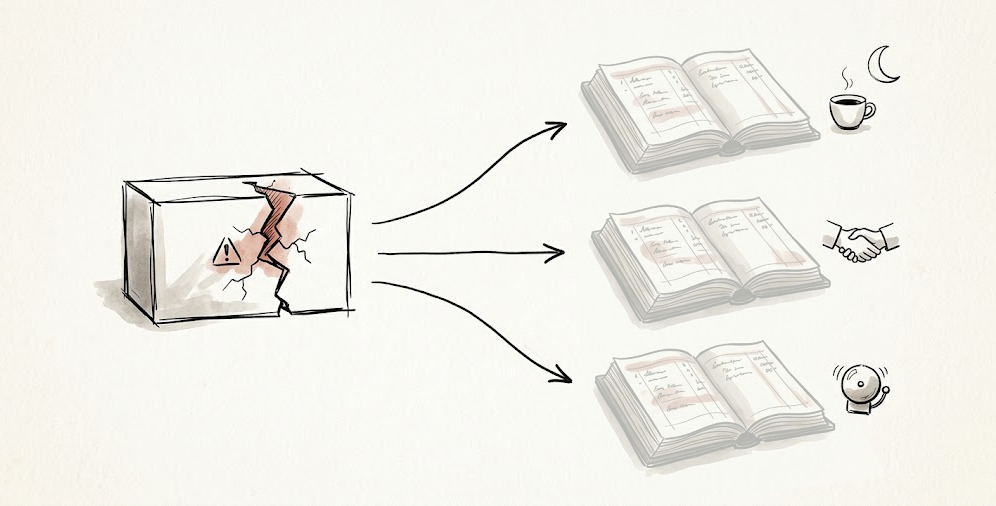

# The Hidden Ledgers of Illegible Systems

**Who pays when your systems don't explain themselves?**

Every error message you didn't write gets written anyway, every exception you didn't catch gets caught anyway. At 2AM. By whoever is standing closest when the thing fails, assembling tribal knowledge, three dashboards, a couple of stale runbooks, a Slack search, and a half-finished tech spec into a diagnosis.

I've given this a name: the **diagnosis tax** — levied the moment something breaks, collected in the human work of turning an unexplained failure into an understood one. Your on-call engineer reviews the stack trace, reads logs, correlates dashboards, digs up tickets and PRs, and reconstructs what the system declined to say.

You didn't skip the work, you deferred it. You booked the savings during development, but these systems are keeping meticulous accounts anyway. You just can't read them.

> An illegible system — one that fails without explaining what broke, what it means, and what to do next — does not merely fail to help. It issues an invoice that is always paid, but never agreed to. And the ledger it's recorded in is hidden.

# The Ledger

The build side is well accounted for on your company's books: staffing, development time, infrastructure. Somewhere there is a spreadsheet comparing what a feature cost to the revenue it creates, and the spreadsheet says the feature is doing great.

The spreadsheet isn't wrong; it's limited. The savings you booked by shipping illegible systems were in dev weeks and dollars. These are currencies your books can hold. The deferred costs from the diagnosis tax are in currencies they can't — spending that shows up nowhere obvious right up until the balance comes due as a **depletion symptom**. It is impossible to measure an engineer's dedication until they tender a resignation that you can't afford. Assessing a customer's goodwill is hard, at least until they don't renew their contract. And you cannot know how much your organization has lost trust in its own alarms before a missed incident that causes real damage.

_My team builds APIs, so these examples are API-shaped. The pattern holds for any product._

The failure emerges **inside the team**

* **The Problem:** Alert names a symptom, not an impact; the log requires the service expert to interpret.
* **The Hidden Ledger:** Engineer dedication — nights and weekends, and the willingness to chase things down.
* **The Depletion Symptom:** Burnout, and the attrition of the people who cared most.

The failure emerges **at the product surface**

* **The Problem:** An error says `500 Internal Server Error` where `state must be one of OPEN, CLOSED, ...` belonged.
* **The Hidden Ledger:** Customer goodwill — their integration engineers' time, their patience during hard weeks, their testimonial for your marketing team.
* **The Depletion Symptom:** Support escalations, slow integrations, churn at contract renewal.

The failure emerges **in monitoring**

* **The Problem:** Alerts fire routinely without clear action a reader can take.
* **The Hidden Ledger:** Signal credibility — the organization's trust in its own instruments.
* **The Depletion Symptom:** Incidents that are waved off, damage that is not remediated.

These hidden ledgers share four properties:

1. **They are finite.** Dedication, goodwill, and credibility all run out.
2. **They deplete silently.** Dashboards don't track them. The balance is invisible while it drains.
3. **They are donated, not budgeted.** Nobody who pays agreed to subsidize design shortcuts. On-call didn't sign up to be the error message. The customer didn't contract to debug your API for you.
4. **The balance is discovered when it reaches zero.** The resignation letter. The non-renewal. The ignored page that mattered. By the time the ledger is legible, it's overdrawn.

You can't read a hidden ledger. But you can stop writing to it.

# Not a Values Problem

I'm not the first to point out that software runs on invisible human effort.

Google's [Site Reliability Engineering](https://sre.google/sre-book/introduction/) built much of its orthodoxy on it: toil should be measured and capped, sustained firefighting is masked underinvestment, and the 2AM save is a symptom, not an achievement.

Resilience Engineering ([Woods](https://snafucatchers.github.io/), [Cook](https://how.complexsystems.fail/), [Allspaw](https://lup.lub.lu.se/student-papers/record/8084520)) went further, stating that complex systems *always* run in degraded mode, kept safe by the continuous adaptation of the humans operating them — a capacity the organization absorbs without ever seeing it.

And Tanya Reilly's [*Being Glue*](https://www.noidea.dog/glue) named the career version: teams run on the coordination work promotion criteria won't measure. The people who do this work — disproportionately the people least empowered to refuse it — get penalized for doing what the organization needs most.

Some of what happens at 2AM is genuine sense-making, novel reasoning about a failure nobody foresaw, work no error message could have pre-empted. That work is not a tax, it's the job, the most valuable thing your engineers do. But that's exactly the point: sense-making capacity is finite, and every hour of it that is spent recovering facts the system already had — which service failed, what state the request was in, what the blast radius is — is an hour billed against a hidden ledger. The diagnosis tax is not levied on the unknowable. It is levied on the knowable-but-withheld.

The ground here is well established: the labor is real, invisible, and unevenly distributed. Here's my addition: **hero culture is *not* a culture problem. It is an accounting artifact.** The standard advice says to stop celebrating firefighting, as though heroics are a values failure. As though somewhere, someone chose heroics. Nobody chooses heroics, they fall into it. The system's illegibility is the design choice made upstream; the hero is the downstream balance owed.

SRE's prescriptions budget the symptom — toil caps and sustainable on-call. Those manage the tax. I want to repeal it.

# Repealing the Tax

You can't solve problems sustainably by asking engineers to read illegible systems harder, to *care* harder. Instead, you make the failure nontaxable by building the system to state its own impact. Concretely, this succeeds when a reader who is not an expert can answer, from the content of an alert or an error message:

**What broke?**

* *In a log or alert:* what specific, feature-level action failed?
* *In an API error:* what was the outcome of the call?

**What does it mean?**

* *In a log or alert:* what is affected, for which customers, and how badly?
* *In an API error:* what was wrong with the request, or why can't it be fulfilled?

**What next?**

* *In a log or alert:* where does a responder look first?
* *In an API error:* what should change, either in the input or the state of the world, for the call to succeed?

The changes needed are smaller than you'd think. The "taxable" version, `500 Internal Server Error`, becomes `409 Cannot modify the state of a widget that is pending fulfillment. Wait for fulfillment to complete, or cancel the order.` One of these costs your customer's integration engineer and your on-call an afternoon (at least) and a support ticket. The other costs you two sentences, written once by the person who understood the failure at the moment they built it. The cost at build is cheaper than the tax at failure: the author has the diagnosis in hand and is calm; the on-call responder has neither.

Notice what that 409 error actually is. For a company whose product is an API, a rejected call isn't the product failing, it's the product working. But an *informative* error that guides a client to correct their own implementation is as much a feature as the functionality the endpoint provides. Features get roadmap time. Filing error quality under hygiene instead keeps spending on the hidden ledger.

These questions translate across products. A CLI tool that dumps a raw stack trace is taxing its user. A config system that silently applies a default is deferring the tax to whoever discovers the default the hard way. A web form that says "something went wrong" is a 500 wearing a friendlier font. Wherever your system meets a person, the standard of legibility is the same: what broke, what does that mean, what next.

New code can be born nontaxable by applying this standard with one question per PR: *"if this fails at 2AM, does it explain itself?"* But your existing debt won't fix itself, and it won't get fixed incidentally either. Often, the worst offenders are stable-enough systems nobody touches. Waiting until planned development happens to visit them so that you can "clean as you go" leaves the oldest and least understood systems a perpetual source of tax. Reducing your tax burden is direct work: inventory the failures humans have had to interpret, rank them by rate of occurrence, and work the list. Deliberately, as a prioritized backlog, not as a virtue squeezed into the margins of feature delivery.

This work is worth doing, because whether you charge the hidden ledger or pay costs up front, your choice compounds. The ongoing presence of debt degrades the reader: people stop reading errors, customers route around your API, on-call defaults to suspicion of alerts. And the more you accrue, the less capable anyone becomes of noticing new charges. Conversely, legible systems get better faster: one taxable failure stands out against a quiet background, gets caught in review, and gets fixed before it is an incident. And the diagnosis budget you stop spending on what's knowable is saved for the novel and unknowable.

# Non-Goal: Blaming the Heroes

Consider the heartwarming news genre where a local community rallies to crowdfund a neighbor's unexpected medical crisis. The generosity is real, and the people are admirable, and every one of these stories is a damning audit finding. The warmth of the story is exactly proportional to the failure of the social system that made the heroism necessary. A society that needed no such stories would be a better one, not a colder one.

If you've read this far and your takeaway is "we should crack down on heroics," then aim carefully. On a hidden ledger, heroes are the creditors. Heroes extend systems an interest-free loan of nights and weekends, and most of them never wanted that role. Being the only person who can read a system isn't status — it's a trap that follows you on vacation.

The industry-standard advice to stop celebrating firefighting and heroics has the causality backwards. Celebration doesn't create hero culture. **Celebration is how underinvestment in legibility gets laundered.** Every time we applaud the person who reverse-engineers a failure, and every time we overlook the engineer who writes a great log line or useful API error message, we convert a system deficiency into a feel-good story, and the deficiency survives another quarter, but with a medal pinned to its jacket.

# Non-Goal: Silence

Repealing the tax does not mean muting alerts or softening errors to make a dashboard green. An alert that fires accurately, states its impact, and points a responder in the right direction is signal, even when it fires often.

The goal is legibility, not quiet for its own sake. If you find yourself silencing pages or filtering out noise with regex, you aren't repealing the tax. If you shrug off customer confusion over an API response because *"every other customer understood it"*, you have most likely already applied charges to several customers' goodwill ledgers and are choosing not to prevent more.

# Non-Goal: Maximalism

The tax is repealed by answering our three questions, not by sheer volume of information. A five-paragraph error or a massive wall of log lines is its own diagnosis tax, levied on reading speed. Verbosity is just illegibility with better intentions.

# Who Pays

A healthy system is not one that never fails. It is one that explains itself when it does. Every illegible system keeps its own accounts in hidden ledgers. The payers are on your team, in your customers' engineering orgs, in your on-call rotation right now — quietly covering the difference between what your systems know and what they say.

The best thing you can build for them is not gratitude. It's the standard for a system that explains itself, and the budget to keep to it.

> This essay is a spiritual companion to [Practicing Radical Reliability as a Leader](https://github.com/jcutler/professional-writing/blob/main/management/radical-reliability/radical-reliability.md). Where *Radical Reliability* argues that people deserve legibility from the humans they report to, this article argues that they deserve it from the systems they operate, as well. The hidden ledger metaphor is just how the argument sneaks its way into the budget meeting.
